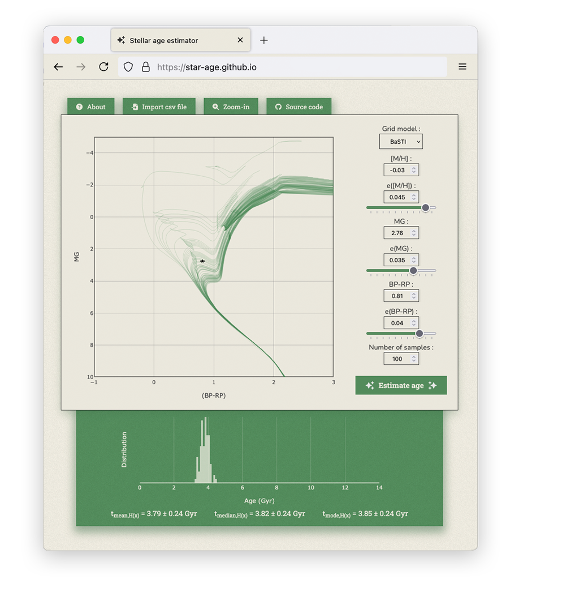

<p align="center">
  
</p>

[](https://star-age.github.io/NEST-docs/) [](https://github.com/star-age/NEST/blob/main/LICENSE) [](https://pypi.org/project/astro-nest/)

**NEST** (**N**eural network **E**stimator of **S**tellar **T**imes) is a python package designed to make the use of pre-trained neural networks for stellar age estimation easy.

It is based on [Boin et al. 2025](https://arxiv.org/abs/2603.09540) (to be published in A&A).

    @ARTICLE{2026arXiv260309540B,
        author = {{Boin}, T. and {Casamiquela}, L. and {Haywood}, M. and {Di Matteo}, P. and {Lebreton}, Y. and {Uddin}, M. and {Reese}, D.~R.},
            title = "{Stellar age determination using deep neural networks: Isochrone ages for 1.3 million stars, based on BaSTI, MIST, PARSEC, Dartmouth and SYCLIST evolutionary grids}",
        journal = {arXiv e-prints},
        keywords = {Astrophysics of Galaxies},
            year = 2026,
            month = mar,
            eid = {arXiv:2603.09540},
            pages = {arXiv:2603.09540},
    archivePrefix = {arXiv},
        eprint = {2603.09540},
    primaryClass = {astro-ph.GA},
        adsurl = {https://ui.adsabs.harvard.edu/abs/2026arXiv260309540B},
        adsnote = {Provided by the SAO/NASA Astrophysics Data System}
    }

You can download the BibTeX citation file here: [NEST.bib](https://raw.githubusercontent.com/star-age/NEST/refs/heads/main/NEST.bib)

With it, you can estimate the ages of stars based on their position in the Color-Magnitude Diagram and their metallicity. It contains a suite of Neural Networks trained on different stellar evolutionary grids. If observational uncertainties are provided, it can compute age uncertainties.

[NEST Documentation](https://star-age.github.io/NEST-docs/)

# Installation :

- Using pip (preferred):
```bash
pip install astro-nest
```

- Download the source code of this repository, and run:
```bash
pip install .
```

- If you are looking for a quick way to test the Neural Networks, a web interface is also available here (click the image):

[](https://star-age.github.io/)

# Dependencies:
- numpy
- scikit (optional but recommended for speed)
- tqdm (optional)
- matplotlib (optional)

The `tutorial.ipynb` notebook guides you through the package usage.
